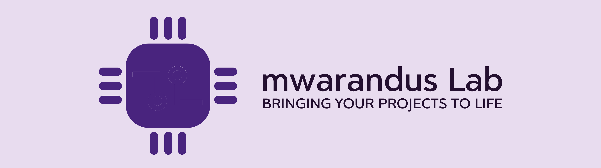

# 
Hi there 👋 Welcome to Mwarandus Lab

Mwarandus Lab is your trusted partner for innovative solutions and we are passionate about leveraging technology to drive meaningful change and deliver exceptional results for our clients. Our dedicated team of professionals combines expertise, creativity, and attention to detail to bring your ideas to life. Whether you're an individual, a startup, or an established business, we have the skills and knowledge to meet your specific needs.

<table>
  <tr>
    <th colspan="2"><h2><b>Services We Offer</b></h2></th>
  </tr>
  <tr>
    <td><b>Website Development</b></td>
    <td>We specialize in creating engaging and user-friendly websites tailored to your unique requirements. Our experienced web developers utilize the latest technologies and best practices to build responsive, visually stunning, and functional websites that leave a lasting impression.</td>
  </tr>
  <tr>
    <td><b>Project Documentation</b></td>
    <td>Clear and comprehensive documentation is essential for the success of any project. Our meticulous approach ensures that every aspect of your project is documented accurately, including specifications, workflows, and guidelines. With our documentation services, you can streamline collaboration, facilitate knowledge transfer, and maintain project continuity.</td>
  </tr>
  <tr>
    <td><b>Circuit Design and Simulation</b></td>
    <td>From simple electronic circuits to complex systems, we excel in designing and simulating circuits to meet your specific objectives. Whether you need a prototype for a new product or a custom circuit for your project, our experts utilize advanced tools and techniques to deliver reliable and efficient solutions.</td>
  </tr>
  <tr>
    <td><b>Payment Integrations for Mpesa</b></td>
    <td>We understand the importance of seamless payment processing for businesses. With our expertise in integrating Mpesa, we enable you to accept mobile payments securely and efficiently, providing convenience to your customers and enhancing your revenue streams.</td>
  </tr>
  <tr>
    <td><b>Internet of Things (IoT)</b></td>
    <td>Embrace the power of IoT with our comprehensive IoT solutions. We assist you in leveraging connected devices, sensors, and data analytics to optimize processes, enhance decision-making, and unlock new possibilities for your business. Experience the transformative potential of IoT in your industry.</td>
  </tr>
  <tr>
    <td><b>Bring Your Idea to Life</b></td>
    <td>Have a brilliant idea but need assistance in turning it into a reality? Our team of experts is here to guide you through every step of the process. From conceptualization and design to prototyping and implementation, we provide comprehensive support to bring your projects to life.</td>
  </tr>
  <tr>
    <td><b>Hardware Repair and Maintenance</b></td>
    <td>Hardware malfunctions can disrupt productivity and cause significant inconvenience. Our experienced technicians offer reliable hardware repair and maintenance services to keep your equipment running smoothly. We diagnose and resolve issues promptly, ensuring minimal downtime for your business.</td>
  </tr>
  <tr>
    <td><b>Hardware Programming</b></td>
    <td>Unlock the full potential of your hardware devices with our hardware programming expertise. We specialize in programming microcontrollers, embedded systems, and other hardware components to enable advanced functionality and seamless integration with software applications.</td>
  </tr>
  <tr>
    <td><b>Product Review</b>
</td>
    <td>Make informed decisions about technology products with our unbiased and insightful product reviews. Our team thoroughly evaluates and analyzes various products, providing you with comprehensive assessments and recommendations to help you choose the right solutions for your needs.</td>
  </tr>
</table>

  <table align="left" style="width: 100%;">
    <tr>
      <th>🔭 We are Currently Working on</th>
      <th>🌱 We are currently Learning</th>
    </tr>
    <tr>
      <td style="text-align: left;">1. Building a 3-Axis CNC Machine</td>
      <td style="text-align: left;">1. Payment Integrations</td>
    </tr>
    <tr>
      <td style="text-align: left;">2. </td>
      <td style="text-align: left;">2. Self-Hosted Home Server</td>
    </tr>
  </table>
 

  
  ✨ Videos of Some the Projects are available at: <a href="https://www.facebook.com/profile.php?id=100066930931043"> Here📻</a>

✨Contact us via: <a href="mailto:info@mwaranduslab.com">info@mwaranduslab.com</a>

✨Visit Our Website: <a href="http://www.mwarandusLab.com" target="_blank">www.mwarandusLab.com</a>

### Technologies We have worked with in Hardware
- [x] `Microcontrollers` -  Arduino, Raspberry Pi, ESP8266, PIC, AVR, etc.
- [x] `Sensors and Actuators` - Temperature and humidity sensors, motion sensors, proximity sensors, motors, servos, relays, etc
- [x] `Communication Protocols` - I2C, SPI, UART, CAN, Ethernet, USB, MQTT, Bluetooth, Wi-Fi, etc.
- [x] `Circuit Simulation` -  Proteus and Eagle
- [x] `Power Electronics` - DC-DC converters, AC-DC converters, voltage regulators, power supplies, etc.
- [x] `Embedded Systems Programming` - C/C++, Arduino IDE, Raspberry Pi GPIO, etc.
- [x] `Internet of Things (IoT)` - IoT platforms, remote control, etc.
- [x] `Hardware Debugging and Testing` - Oscilloscopes and multimeters
### Technologies We have worked with in Software
- [x] `Version Control` -  Git and GitHub
- [x] `Web Development` - HTML, CSS, JavaScript, React, Angular, Node.js and Django
- [x] `Database Systems` - MySQL, PostgreSQL, and SQLite
### Languages

### Platform 

### Github Stats

<h3 align="left">Let's Connect :handshake:</h3>

<a target="_blank"
href="http://www.linkedin.com/in/kheri-mwarandu-9a054319a/"></img></a> <a target="_blank"
href="mailto:info@mwaranduslab.com"></img></a> <a target="_blank"
href="https://twitter.com/MwarandusLab"></img></a>

<!-- **MwarandusLab/MwarandusLab** is a ✨ _special_ ✨ repository because its `README.md` (this file) appears on your GitHub profile.

Here are some ideas to get you started:

- 🔭 I’m currently working on ...
- 🌱 I’m currently learning ...
- 👯 I’m looking to collaborate on ...
- 🤔 I’m looking for help with ...
- 💬 Ask me about ...
- 📫 How to reach me: ...
- 😄 Pronouns: ...
- ⚡ Fun fact: ...
-->
